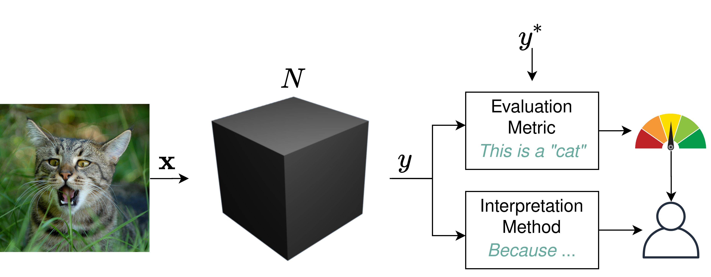
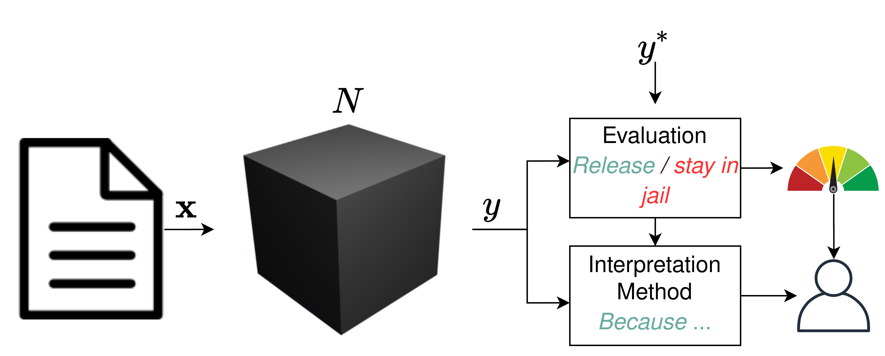

# Motivation

# Omnipresent Machine Learning
<!-- ml used for a lot of different tasks, as an example we can think of the example of image classif into an object category, where the performance of a model is mostly / per default measured wrt accuracy and efficiency-->

* Verification of machine learning algorithms mostly w.r.t. accuracy and efficiency 

{ width=60% }

# Omnipresent Machine Learning
<!-- ..but this is not enough: focus is shifting to better understand why a dacision was made instead of just answering how well a model performs -->

* Verification of machine learning algorithms mostly w.r.t. accuracy and efficiency 
* Also Interpretability: Uncovering why a model made a decision

{ width=60% }

# Omnipresent Machine Learning
<!-- ..but this is not enough: focus is shifting to better understand why a dacision was made instead of just answering how well a model performs -->

* Verification of machine learning algorithms mostly w.r.t. accuracy and efficiency 
* Also Interpretability: Uncovering why a model made a decision

{ width=60% }

* Especially: 
  * Critical applications: Politics, Medicine, ... <!-- Even more crucial when moving to critical applications such as recidivism risk / release decisions (~US California proposition 25: Replace cash bail by automated risk assessment/system) -->
  <!-- * Regulations: 
      * Right to explanation (GDPR 2018)
      * California-25: Cash bail  -->
  

# Interpretability 

<!-- mostly we do not know how the model decides, as the structure is too compex -->
 
# Motivation

# Interpretation Methods

# Adversarial Setting

## Adversarials: How to fool a model
* Adversarial examples \cite{}

# Interpreter Manipulation Methods

# Fooling Examples

# References

# Sources
